  <a href="https://github.com/gbrlevi">
    <picture>
      <source media="(prefers-color-scheme: dark)" srcset="dark_mode.svg">
      
    </picture>
  </a>

<table>
<tr>

<td width="58%" valign="top">

## 🗝️ Hi, I'm Gabriel Levi

> Hey! I'm a **Computer Science** student at **UNIFOR** and **Software Engineer** at **Exitus**, obsessed with building resilient, low-latency software.

> My core focus lies in **backend architecture, operating systems internals, and security**, understanding how systems behave down to the wire. In parallel, my senior thesis (TCC) explores deep learning applied to **kinematic pose estimation and real-time motion analysis (ST-GCN)**. Off the clock, you'll find me **tinkering with homelabs & hardware modding**, fine-tuning **sound setups**, and taking a lifelong detour through **Kingdom Hearts**.

 

### *"Got it memorized?"*

</td>

<td width="42%" valign="top">

</td>

</tr>
</table>